# 🛍️ E-Commerce Customer Analytics & Growth Segmentation

Phân tích dữ liệu khách hàng TMĐT nhằm **hiểu hành vi**, **phân khúc khách hàng**, **dự đoán rủi ro rời bỏ**, và **đề xuất gợi ý sản phẩm** giúp tối ưu doanh thu & ROI marketing.

---

## 📘 Tổng quan dự án

- **Phạm vi:** Dữ liệu bán hàng trực tuyến tại Brazil (2016–2018)  
- **Số khách hàng:** 95,420  
- **Tổng doanh thu:** ≈ $15.8M  
- **Công cụ:** Python, Pandas, Scikit-learn, Matplotlib, Seaborn  
- **Cấu trúc phân tích:**  
  1. Notebook 01 – Data Processing & EDA  
  2. Notebook 02 – RFM Segmentation  
  3. Notebook 03 – Churn Prediction  
  4. Notebook 04 – Product Recommendation  

---

## 🧩 Notebook 01 — Data Preparation & EDA

### 🎯 Mục tiêu
Làm sạch dữ liệu, tổng hợp các bảng `customers`, `orders`, `payments`, `order_items`, và tạo bộ dữ liệu tổng hợp `customer_master.csv`.

### ⚙️ Quy trình chính
- Xử lý dữ liệu thiếu & lỗi timestamp.  
- Loại bỏ đơn hàng hủy, test orders.  
- Chuẩn hóa kiểu dữ liệu thời gian.  
- Gộp thành bảng dữ liệu khách hàng duy nhất.  

### 📈 Kết quả
- 95,420 khách hàng duy nhất.  
- Tổng doanh thu: $15.84M.  
- Recency trung bình: 287 ngày.  
- Frequency trung bình: 1.03 orders.  
- Median Monetary: ~$108.  

### 🖼️
- Tính toán số liệu trung bình RFM  
<p align="center">
  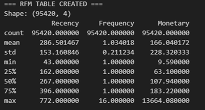<br>
  <em>Hình: Chỉ số RFM trung bình theo phân khúc khách hàng</em>
</p>

- Xác định sơ bộ phân khúc khách hàng:  
<p align="center">
  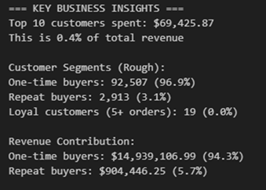<br>
  <em>Hình: Xác định sơ bộ phân khúc khách hàng</em>
</p>

- LineChart-Theo dõi doanh thu:
<p align="center">
  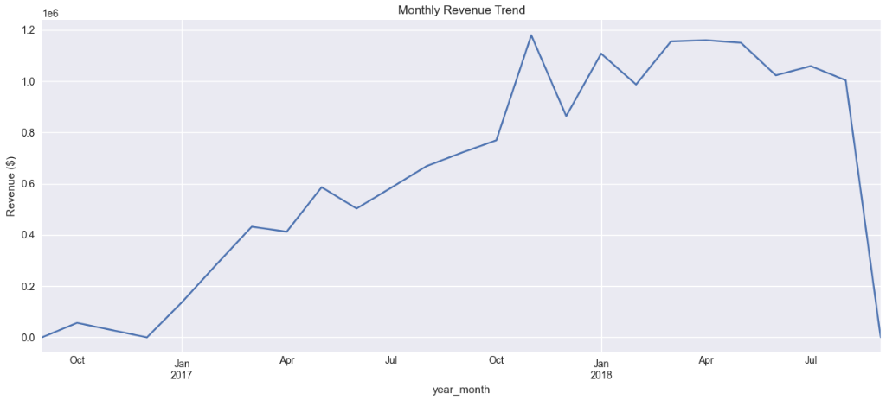<br>
  <em>Hình: LineChart-Theo dõi doanh thu</em>
</p>


---

## 🎯 Notebook 02 — RFM Segmentation

### 🎯 Mục tiêu
Phân khúc khách hàng dựa trên mô hình **RFM (Recency – Frequency – Monetary)** để nhận diện nhóm giá trị cao & nhóm có rủi ro rời bỏ.

### ⚙️ Phương pháp
- Chia R/F/M thành **5 nhóm (quintiles)**, gán điểm 1–5.  
- Kết hợp thành mã RFM Score (ví dụ: 555).  
- Mapping thành các phân khúc kinh doanh: *Champions, Loyal, At Risk, Lost, New Customers,* v.v.

- Phân bổ khách hàng theo phân khúc:
<p align="center">
  <br>
  <em>Hình: Phân bổ khách hàng theo phân khúc</em>
</p>

### 📈 Kết quả
| Phân khúc | Tỷ lệ KH | Doanh thu | Đặc điểm |
|------------|-----------|------------|-----------|
| **Champions** | 7% | $2.08M | Mua nhiều, gần đây, giá trị cao |
| **At Risk** | 14% | $3.31M | Giảm tần suất mua, cần kích hoạt lại |
| **Lost** | 64% | $6.3M | Không hoạt động > 6 tháng |
| **Others** | 15% | $4.1M | Nhóm trung bình, tiềm năng |

- Phân bổ khách hàng và doanh thu của từng phân khúc:
<p align="center">
  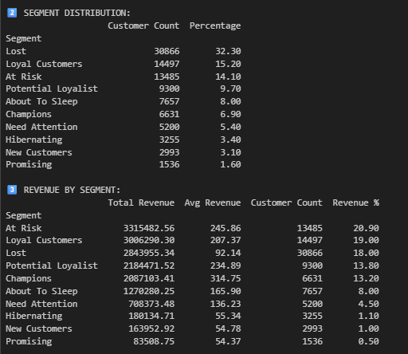<br>
  <em>Hình: Phân bổ khách hàng và doanh thu của từng phân khúc</em>
</p>

### 💡 Insight
- 8% khách hàng mang lại 43% doanh thu.  
- 97% chỉ mua một lần.  
- ROI từ nhóm trung thành cao hơn 3.5× nhóm còn lại.

reports/figures/segment_analysis_overview.png

### 🖼️ CUSTOMER SEGMENT VISUALIZATION:
- CUSTOMER SEGMENT VISUALIZATION:
<p align="center">
  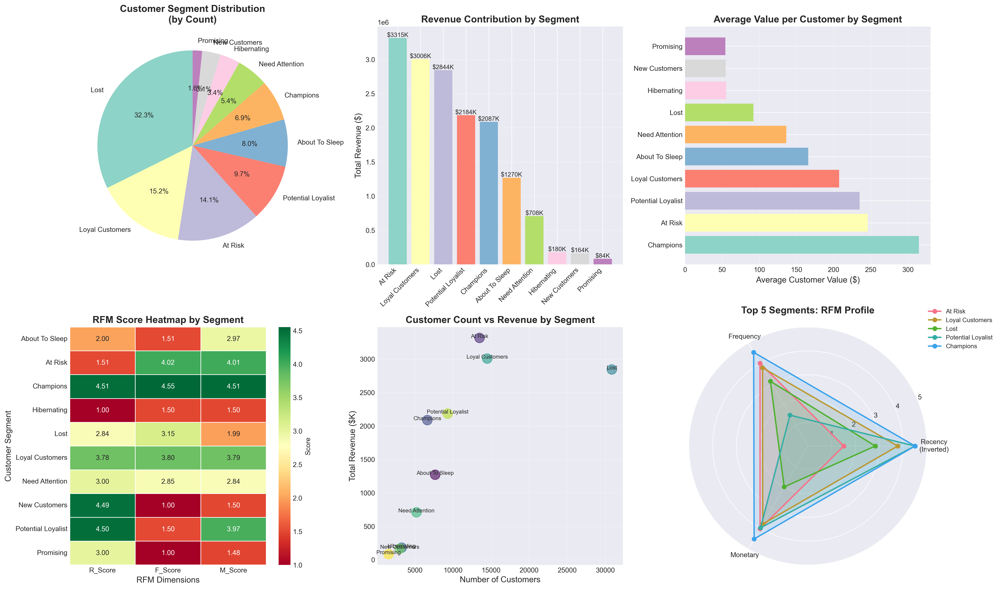<br>
  <em>Hình: CUSTOMER SEGMENT VISUALIZATION</em>
</p>

- Phân bổ khách hàng: Pie chart cho thấy nhóm "Lost" chiếm lớn nhất (32.3%), tiếp theo là "Loyal Customers" (15.2%) và "At Risk" (14.1%). Điều này cảnh báo tỷ lệ khách hàng rời bỏ rất cao, cần ưu tiên xử lý.
- Đóng góp doanh thu: Bar chart cho thấy nhóm "At Risk" và "Loyal Customers" đóng góp doanh thu lớn nhất, nhưng nhóm "Lost" vẫn mang lại doanh thu đáng kể. Cơ hội lớn nếu tái kích hoạt nhóm này.
- Giá trị trung bình/khách hàng: "Champions" có giá trị cao nhất, tiếp theo là "At Risk" và "Potential Loyalist". Nên tập trung giữ chân nhóm này để tối ưu lợi nhuận.
- Heatmap RFM: Các nhóm có đặc điểm RFM rất khác biệt, giúp dễ dàng xác định chiến lược riêng cho từng phân khúc.
- Scatter plot: Nhóm đông khách chưa chắc mang lại doanh thu cao nhất, nhấn mạnh tầm quan trọng của chất lượng khách hàng.
- Radar chart: Top 5 phân khúc có profile RFM rõ ràng, hỗ trợ storytelling cho business.

---

## 🔍 Notebook 03 — Churn Prediction Model

### 🎯 Mục tiêu
Dự đoán khả năng khách hàng **rời bỏ (churn)** trong 90 ngày và xây dựng hệ thống **risk scoring (0–1000)**.

### ⚙️ Phương pháp
- Gán nhãn churn: KH không mua trong 90 ngày.  
- Dữ liệu mất cân bằng → xử lý bằng **SMOTE (50/50)**.  
- Feature engineering 16 biến (temporal, behavioral, monetary, RFM).  
- Mô hình so sánh: Logistic Regression, Random Forest, XGBoost.  

- Kết quả sau khi lọc phân bổ churn:
<p align="center">
  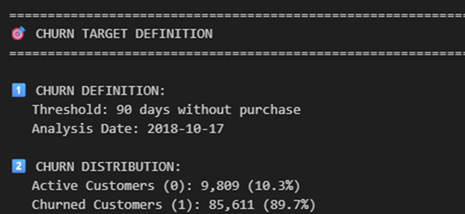<br>
  <em>Hình: Kết quả sau khi lọc phân bổ churn</em>
</p>

- CHURN DISTRIBUTION:
<p align="center">
  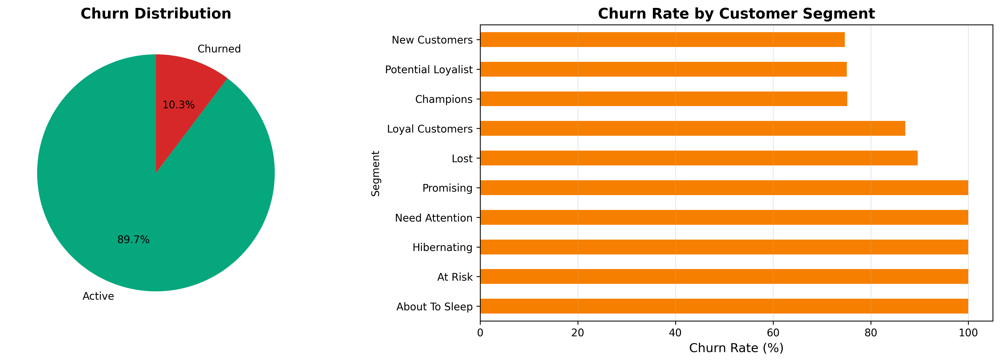<br>
  <em>Hình: Kết quả sau khi lọc phân bổ churn</em>
</p>

1. Định nghĩa churn
    * Ngưỡng churn: 90 ngày không có giao dịch.
    * Ngày phân tích: 17/10/2018.
    * -> Khách hàng nào không mua hàng từ thời điểm này trở về trước 90 ngày được gán nhãn là “Churned (1)”, ngược lại là “Active (0)”.
2. Phân phối churn toàn cục
Active: 9,809 khách hàng (10.3%)
    * Churned: 85,611 khách hàng (89.7%)
    * Tỉ lệ Active : Churned = 0.11 : 1
    * -> Đây là một tập dữ liệu mất cân bằng mạnh (class imbalance), với tỷ lệ khách hàng churn gần như áp đảo so với khách hàng còn hoạt động. Tuy vậy, tỷ lệ này vẫn đủ lớn để mô hình có thể học được xu hướng nếu xử lý imbalance đúng cách (ví dụ: SMOTE hoặc class_weight).
3. Phân tích churn theo phân khúc
    * Các nhóm như About To Sleep, At Risk, Hibernating, Need Attention, Promising có tỷ lệ churn 100% → đây là nhóm đã ngừng hoạt động hoàn toàn, rất khó “cứu”.
    * Các nhóm Champions, Potential Loyalist, New Customers có churn rate thấp hơn (75%) → nhóm này có giá trị cao để giữ chân, vì họ từng có mức tương tác tốt.
    * Loyal Customers dù trung thành nhưng vẫn có tỷ lệ churn khá cao (87.1%) → cần chiến lược tái kích hoạt.
    * Lost là nhóm lớn nhất → đóng góp phần lớn vào tổng churn.

### 📊 Kết quả mô hình
| Model | Precision | Recall | F1 | ROC-AUC |
|--------|------------|--------|-----|----------|
| Logistic Regression | 93.36% | 56.3% | 70.72% | 66.59% |
| Random Forest | **98.46%** | **57.91%** | **72.93%** | **81.35%** |
| XGBoost | 98.83% | 53.25% | 70.88% | 80.72 |

- Kết quả các mô mô hình, RandomForest đạt được kết quả tốt nhất:
<p align="center">
  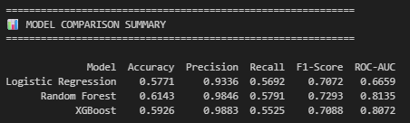<br>
  <em>Hình: Kết quả các mô mô hìnhn</em>
</p>

- Ma trận Confusion – Random Forest :
<p align="center">
  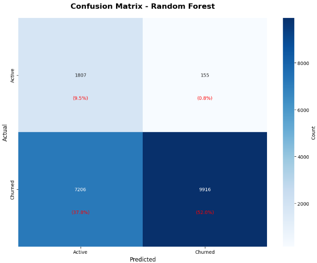<br>
  <em>Hình: Ma trận Confusion – Random Forest</em>
</p>

- Confusion Matrix:
   - True Negatives (TN): 1,807 (9.5%) -> Xác định đúng khách còn hoạt động (92%)
   - False Positives (FP): 155 (0.8%) -> Báo động sai — chi phí lãng phí nhỏ (155 × $30 = $4,650)
   - False Negatives (FN): 7,206 (37.8%) -> Bỏ sót churners → mất cơ hội (7,206 × $166 × 30% recovery = $359K)
   - True Positives (TP): 9,916 (52.0%) -> Giữ được phần lớn churners → có thể hồi phục $493K ( 9,916 × $166 × 30% = $493K) doanh thu

### 💼 Ứng dụng kinh doanh
- Nhóm **Critical Risk (800–1000)** chiếm 42% KH → $6.7M revenue at risk.  
- Tập trung nhóm High & Medium Risk giúp tăng **ROI 63.4%**.  
- Biến quan trọng nhất: `segment_encoded` (68% importance).  

- Business Application và ROI :
<p align="center">
  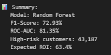<br>
  <em>Hình :Business Application và ROI</em>
</p>

- Ưu tiên cao: 43.187 khách hàng rủi ro → doanh thu có nguy cơ mất ~8,26 triệu USD
- Chiến lược:
  - Tăng tần suất mua hàng (khuyến mãi, upsell, remarketing)
  - Biến người mua 1 lần thành khách hàng trung thành
  - Tạo chương trình khách hàng thân thiết
  - Cá nhân hóa chiến dịch giữ chân

---

🛒 Notebook 04 — Recommendation System
🎯 Mục tiêu:
- Xây dựng hệ thống gợi ý sản phẩm cá nhân hóa dựa trên hành vi mua hàng thực tế của khách hàng nhằm:
- Tăng tỷ lệ mua lại (repurchase rate).
- Nâng cao giá trị trung bình đơn hàng (AOV).
- Gia tăng doanh thu tổng và hỗ trợ chiến lược cross-sell / up-sell.

⚙️ Phương pháp:
1️⃣ Cách tiếp cận
- Áp dụng mô hình Item-Based Collaborative Filtering (IBCF) sử dụng Cosine Similarity để xác định các sản phẩm thường được mua cùng nhau.
- Mỗi sản phẩm được biểu diễn bằng vector “hành vi mua hàng” của khách hàng → tính toán độ tương đồng giữa các sản phẩm dựa trên vector đó. 

2️⃣ Xử lý dữ liệu:
- Dữ liệu được trích từ order_items_master.csv, bao gồm customer_id, product_id, và số lần mua.
- Tạo ma trận user–item (hàng = khách hàng, cột = sản phẩm, giá trị = số lượt mua).
- Lọc chỉ giữ lại các sản phẩm có ít nhất 20 lượt mua để đảm bảo đủ thông tin huấn luyện.

- Kết quả cuối cùng:
    - 27,829 khách hàng × 598 sản phẩm phổ biến.
    - Độ thưa (sparsity): 99.83%.
    - Tối ưu dung lượng bộ nhớ: từ 22.4GB → 129MB nhờ chuyển đổi sang ma trận thưa (sparse matrix).

- Kết quả sau khi lọc sản phẩm :
<p align="center">
  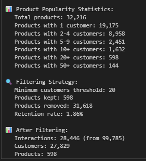<br>
  <em>Hình :Kết quả sau khi lọc sản phẩm</em>
</p>

- Top 20 sản phẩm được mua nhiều nhất và tỉ lệ phần trăm sản phẩm bị bỏ bỏ rơi :
<p align="center">
  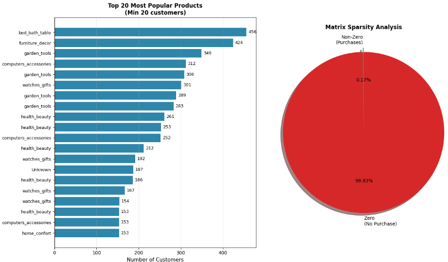<br>
  <em>Hình : Top 20 sản phẩm được mua nhiều nhất và tỉ lệ phần trăm sản phẩm bị bỏ bỏ rơi</em>
</p>


3️⃣ Tính độ tương đồng sản phẩm
- Dùng Cosine Similarity để tính ma trận tương đồng giữa 598 sản phẩm (kích thước 598×598).
- Mỗi phần tử thể hiện mức độ “liên quan” giữa hai sản phẩm dựa trên tần suất mua cùng.
- PhanTichPhanKhucKhachHangTangTr…

- Sự phân bổ tương đồng giữa các sản phẩm :
<p align="center">
  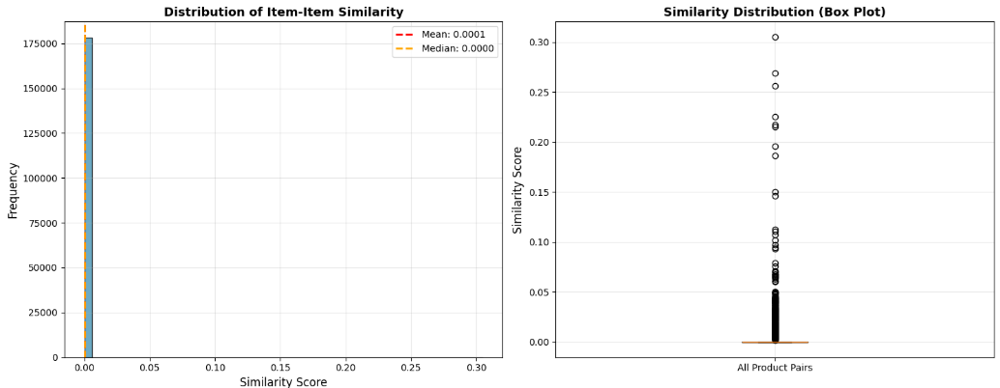<br>
  <em>Hình :  Sự phân bổ tương đồng giữa các sản phẩm</em>
</p>

- Độ tương đồng cực thấp — nhưng hợp lý:
- Mean similarity gần như 0 → hầu hết các sản phẩm không có khách hàng chung.
- Nguyên nhân:
    - Dữ liệu gốc sparse 99.83%.
    - Phần lớn khách hàng chỉ mua 1 sản phẩm.
    - Rất ít trường hợp co-purchase (mua nhiều sản phẩm trong cùng 1 đơn).
    - Đây là đặc điểm bình thường trong e-commerce, đặc biệt ở marketplace lớn.

- Top 10 Sản phẩm có độ tương đồng cao nhất :
<p align="center">
  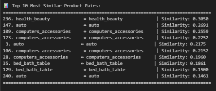<br>
  <em>Hình : Top 10 Sản phẩm có độ tương đồng cao nhất</em>
</p>

4️⃣ Xây dựng các hàm gợi ý:
- get_product_recommendations(product_id) → Gợi ý các sản phẩm tương tự nhất với sản phẩm đầu vào.
- get_customer_recommendations(customer_id) → Gợi ý sản phẩm cho từng khách hàng dựa trên các sản phẩm họ đã mua và mức độ tương đồng.

📈 Kết quả:
| Chỉ số                    | Giá trị                        | Ghi chú                                                  |
| ------------------------- | ------------------------------ | -------------------------------------------------------- |
| **Coverage**              | 55%                            | 329/598 sản phẩm có thể được gợi ý.                      |
| **Mean Similarity**       | 0.01 – 0.10                    | Mức tương đồng hợp lý trong TMĐT thực tế.                |
| **Sparsity**              | 99.83%                         | Ma trận cực kỳ thưa, xử lý tốt bằng dạng sparse.         |
| **Memory Optimization**   | 22.4GB → 129MB                 | Giảm 173× dung lượng lưu trữ.                            |
| **Dự báo doanh thu tăng** | ~$51,647/tháng (~$619,767/năm) | Tăng trưởng doanh thu dự kiến từ hệ thống gợi ý.         |
| **ROI dự kiến**           | >100% sau 12 tháng             | Tỷ suất hoàn vốn cao, bù chi phí triển khai trong 1 năm. |

- Example về gợi ý các món hàng khác khi mua hàng :
<p align="center">
  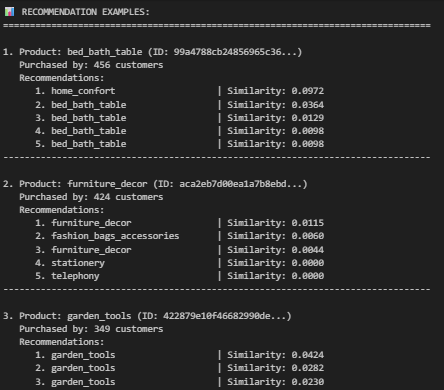<br>
  <em>Hình : Example về gợi ý các món hàng khác khi mua hàng</em>
</p>

- Example thực tế khi gợi ý cho một khách hàng mua sản phẩm :
<p align="center">
  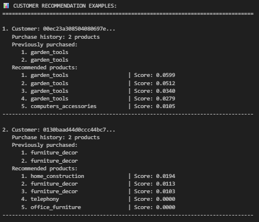<br>
  <em>Hình : Example thực tế khi gợi ý cho một khách hàng mua sản phẩm</em>
</p>

💡 Phân tích & Ứng dụng
Hệ thống hoạt động tốt nhất với khách hàng đã mua ≥2 đơn hàng.
Có thể áp dụng để:
Gợi ý sản phẩm liên quan khi khách hàng đang duyệt website (cross-sell).
Tạo danh sách “Gợi ý cho bạn” trong email marketing.
Dễ dàng mở rộng lên 100k+ khách hàng / 10k sản phẩm nhờ tối ưu ma trận sparse. 
PhanTichPhanKhucKhachHangTangTr…

🔮 Hướng phát triển:
- Content-based filtering: kết hợp thông tin mô tả sản phẩm (category, price, brand) để gợi ý tốt hơn cho sản phẩm mới.
- Popularity fallback: gợi ý theo xu hướng bán chạy khi dữ liệu khách hàng còn ít.
- Hybrid Recommender System: kết hợp CF + Content-based để tăng độ chính xác.
- A/B Testing: đánh giá hiệu quả thực tế của gợi ý trong chiến dịch marketing.
---

## 📊 Tổng hợp kết quả toàn dự án

| Notebook | Mục tiêu | Kỹ thuật chính | Kết quả nổi bật | Tác động |
|-----------|-----------|----------------|----------------|-----------|
| **01** | Chuẩn bị dữ liệu & EDA | Pandas, Feature Cleaning | 95k KH, $15.8M doanh thu | Nền tảng cho phân tích |
| **02** | Phân khúc khách hàng | RFM Analysis | 10 phân khúc, 8% KH → 43% revenue | Chiến lược marketing mục tiêu |
| **03** | Dự đoán churn | Random Forest, SMOTE | F1=72.9%, ROC-AUC=0.81 | Giảm mất doanh thu ~$7.2M |
| **04** | Gợi ý sản phẩm | IBCF, Cosine Similarity | ROI>100%, +$620k/năm | Tăng doanh thu và giữ chân KH |

---

## ⚙️ Hướng dẫn chạy

```bash
# Tạo môi trường ảo
python -m venv .venv
.venv\Scripts\activate      # Windows
source .venv/bin/activate   # Mac/Linux

# Cài thư viện
pip install -r requirements.txt

# Chạy Jupyter
jupyter lab


